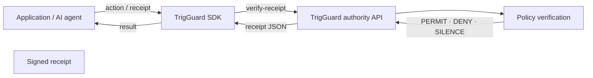

# TrigGuard JavaScript SDK

> **Deprecation notice:** This standalone repo is superseded by the canonical product SDK on npm: **`npm install trigguard`**. New integrations should use [`createTrigGuard()`](https://github.com/TrigGuard-AI/TrigGuard/blob/main/docs/adoption/FIRST_10_MINUTES.md) from the [TrigGuard monorepo](https://github.com/TrigGuard-AI/TrigGuard). This package remains for legacy HTTP client use only.

[](https://github.com/TrigGuard-AI/trigguard-js/actions/workflows/ci.yml)
[](https://www.npmjs.com/package/trigguard)

**TrigGuard is a verification layer:** autonomous apps and agents only execute irreversible actions when backed by an auditable **PERMIT** (or **DENY** / **SILENCE**) receipt from the authority.

This package is the **minimal HTTP client** for the public **trigguardai.com** protocol surface. For TypeScript types use **`@trigguard/protocol`**. For the fuller gateway SDK from the core monorepo, see **`@trigguard/sdk`** (different package).

---

## Quickstart

```bash
npm install trigguard
```

```js
import { TrigGuard, TrigGuardError } from "trigguard";

const tg = new TrigGuard();

const receipt = {
  decision: "PERMIT",
  timestamp: new Date().toISOString(),
};

try {
  const result = await tg.verify.receipt(receipt);
  if (!result.valid) throw new Error("invalid receipt");
  console.log(result.valid, result);
} catch (err) {
  if (err instanceof TrigGuardError) {
    console.error(err.code, err.message, err.request_id);
  }
  throw err;
}
```

---

## Install

```bash
npm install trigguard
```

From a git clone:

```bash
npm install ./path/to/trigguard-js
```

---

## Request flow

TrigGuard sits **between** your application and execution: the SDK talks to the **public protocol API**; the **authority** runs policy verification and returns a **signed receipt**; your app gates the real-world action on that outcome.



---

## Examples

**Run the repo example:**

```bash
node examples/verify-receipt.js
```

**`curl` (no install):**

```bash
curl -sS https://trigguardai.com/protocol/test-vectors | head
```

```bash
curl -sS -X POST https://trigguardai.com/protocol/verify-receipt \
  -H "Content-Type: application/json" \
  -d '{"decision":"PERMIT","timestamp":"2026-01-01T00:00:00.000Z"}'
```

**Custom authority** (enterprise / self-hosted):

```js
const tg = new TrigGuard({
  authority: "https://trigguardai.com",
});
```

String shorthand: `new TrigGuard("https://your-authority.example")`.  
Node env fallbacks: **`TRIGGUARD_AUTHORITY`** or **`TRIGGUARD_BASE_URL`**.

---

## API

| Member | Description |
|--------|-------------|
| `new TrigGuard(options?)` | Client; default authority `https://trigguardai.com` |
| `tg.authority` | Resolved origin (no trailing slash) |
| `tg.verify.receipt(body)` | `POST /protocol/verify-receipt` |
| `tg.verify.signature(body)` | `POST /protocol/verify-signature` |
| `tg.protocol.capabilities()` | `GET /protocol/capabilities` |

### Errors

Failures throw **`TrigGuardError`** (extends `Error`):

- `err.code` — machine-readable (from API when present, else `HTTP_ERROR` / `NETWORK_ERROR`)
- `err.message` — human-readable
- `err.request_id` — when the authority returns one
- `err.status` — HTTP status when applicable
- `err.body` — parsed JSON body when available
- `err.toJSON()` — stable shape for logs

---

## What this is

**TrigGuard** is execution-governance infrastructure: deterministic **PERMIT / DENY / SILENCE** before irreversible actions, with verifiable receipts. This SDK does **not** embed policy evaluation — that lives in **authority** / hosted services.

- **Types & constants (npm):** [`@trigguard/protocol`](https://www.npmjs.com/package/@trigguard/protocol)
- **Core monorepo:** [TrigGuard-AI/TrigGuard](https://github.com/TrigGuard-AI/TrigGuard)
- **This SDK:** [TrigGuard-AI/trigguard-js](https://github.com/TrigGuard-AI/trigguard-js)

---

## License

Apache-2.0 — see [LICENSE](./LICENSE) and [NOTICE](./NOTICE).
